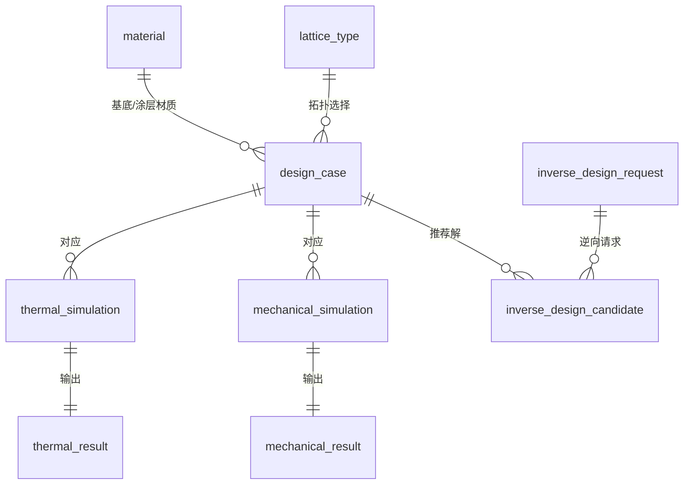

# 3D 打印点阵骨架 + 热电涂层（核壳结构）热电器件的机器学习逆向工程方案

本方案旨在针对**“3D 打印基底点阵 + 表面包覆热电薄膜（Core-Shell Lattice-Coating）”**这一新型热电器件（TEG）制备工艺，构建“设计变量 $X \to$ 等效性能 $Y \to$ 机器学习代理模型 $\to$ 场景化逆向设计”的完整研发工作流。

---

## 1. 物理机理与等效物性建模 (Forward Physics)

传统的温差发电机（TEG）主要由实心柱状支腿构成，存在**热量淤积（漏热快）**与**力学脆性**两大痛点。2023 年 Nature Communications 文章提出利用 3D 打印的韧性高分子点阵（如部分碳化树脂）作为骨架，在外层镀上约 $1\ \mu\text{m}$ 的热电薄膜。由于基底不导电且导热极低，电流和大部分温差会被局限在超薄的外层三维网络中。

在这种“核-壳”复合超材料中，器件的**宏观等效热电性能**与骨架几何、涂层厚度及本征材料物性呈高度非线性关系。

### 1.1 等效热导率 ($\kappa_{eff}$)
三维复合结构的总等效热导率由基底骨架、涂层薄膜以及内部孔洞（空气或真空）的并联导热决定：
$$\kappa_{eff} = f_{ske} \cdot \kappa_{ske} + f_{coat} \cdot \kappa_{coat} + (1 - f_{ske} - f_{coat}) \cdot \kappa_{void}$$
* 由于高分子骨架的本征热导率 $\kappa_{ske} \approx 0.2\ \text{W m}^{-1}\text{K}^{-1}$ 极低，且其体积分数 $f_{ske}$ 经过多孔点阵设计可控制在 $10\%\text{--}30\%$。
* 薄膜虽然本征热导率较高（如 $\text{Bi}_2\text{Te}_3 \approx 1.2\ \text{W m}^{-1}\text{K}^{-1}$），但因为厚度在微纳米级，其体积分数 $f_{coat}$ 极小。
* 因此，宏观等效热导率 $\kappa_{eff}$ 可以被压低到一个极小的数值（接近甚至低于空气热导率），从而在极短的器件厚度上维持极高的温差 $\Delta T$。

### 1.2 等效电导率 ($\sigma_{eff}$)
由于基底高分子完全不导电（$\sigma_{ske} \approx 0$），电流完全由外层的三维热电薄膜网络输运：
$$\sigma_{eff} = \mathcal{C}_{net} \cdot \left(\frac{t}{d_s}\right) \cdot \sigma_{coat}$$
* $\mathcal{C}_{net}$ 是与点阵几何拓扑相关的连通性系数。
* $t$ 为涂层厚度，$d_s$ 为点阵支柱直径。
* 拓扑优化的目的之一是确保电通路连通性 $\mathcal{C}_{net}$ 最大化的同时，尽量减小支柱直径 $d_s$ 以降低热传导。

### 1.3 等效塞贝克系数 ($S_{eff}$)
因为高分子基底没有电信号贡献，复合结构的宏观等效塞贝克系数主要取决于涂层薄膜材料的本征塞贝克系数 $S_{coat}$。但在温度场分布不均匀的变截面（如沙漏型）结构中，等效塞贝克系数会被局域温差调制：
$$S_{eff} \approx \frac{\int_{0}^{L} S_{coat}(T) \cdot \nabla T(z) \, dz}{\Delta T_{total}}$$

### 1.4 器件等效热电优值 ($zT_{eff}$)
最终，器件整体的宏观发电性能由等效热电优值评估：
$$zT_{eff} = \frac{S_{eff}^2 \cdot \sigma_{eff}}{\kappa_{eff}} \cdot T$$
**核心优势**：通过 3D 拓扑结构将 $\kappa_{eff}$ 的下降幅度做得比 $\sigma_{eff}$ 的下降幅度更大，从而在系统层面实现 $zT_{eff}$ 的提升。

---

## 2. 设计变量参数空间 (Design Variables)

在逆向工程中，算法可以在以下三个维度的参数空间进行搜索：

| 维度 | 参数名称 | 符号/单位 | 说明 |
| :--- | :--- | :--- | :--- |
| **骨架几何** | 点阵拓扑类型 | Lattice Type | 如 Gyroid (TPMS), FCC truss, Diamond, 拓扑优化形状 |
| | 单胞尺寸 | $L_x, L_y, L_z$ (mm) | 控制点阵的宏观尺寸和单胞尺度 |
| | 支柱直径 / 体积分数 | $d_s$ (mm) / $V_f$ (%) | 控制骨架的粗细与基础孔隙率 |
| | 阵列排布数 | $N_x, N_y, N_z$ | 单胞在三维空间中的周期性复制数量 |
| **涂层设计** | 涂层厚度 | $t$ ($\mu\text{m}$) | 包覆在骨架外表面的薄膜物理厚度，通常为 0.1 ~ 5 µm |
| | 涂层材料物性 | $S_0, \sigma_0, \kappa_0$ | 备选材料（如 Bi2Te3, Sb2Te3, PbTe 等）的本征电热参数 |
| **基底设计** | 骨架本征物性 | $E_s, \kappa_s, \rho_s$ | 3D 打印树脂或高分子碳化后的力学模量、热导率及密度 |

---

## 3. 多场景匹配的逆向工程目标 (Application Scenarios)

没有一种几何结构能适用于所有环境。逆向工程的目的是根据**具体应用场景的物理约束**，反推最合适的设计变量组合。

```
                  +--------------------------+
                  |  用户输入: 具体应用场景    |
                  +--------------------------+
                               |
        +----------------------+----------------------+
        |                      |                      |
        v                      v                      v
+------------------+   +------------------+   +------------------+
|   场景一: 穿戴式 |   |   场景二: 工业级 |   |   场景三: 力学重载 |
|   人体温差收集   |   |   高温尾气回收   |   |   振动与应力约束 |
+------------------+   +------------------+   +------------------+
        |                      |                      |
* 极低漏热约束          * 热阻匹配约束          * 抗压与吸能限制
* 最大化电压输出        * 最大化功率密度        * 避免剪切/脆性断裂
        |                      |                      |
        +----------------------+----------------------+
                               |
                               v
                  +--------------------------+
                  |   ML 逆向算法求解最优解   |
                  +--------------------------+
```

### 3.1 场景一：穿戴式微能量收集（人体发电）
* **物理约束**：人体与环境温差极小（$\Delta T \approx 5\text{--}10\text{ K}$），且冷侧仅靠自然对流散热（对流系数 $h \approx 10\ \text{W m}^{-2}\text{K}^{-1}$）。
* **设计诉求**：如果器件导热过快（$\kappa_{eff}$ 高），热量会瞬间从热侧漏到冷侧，导致两端实际温差几乎为 0。因此必须**最大化热阻**，阻挡热流量。
* **逆向目标**：高孔隙率基底骨架（如极细的 Gyroid） + 极薄的涂层（纳米级），牺牲一部分导电率，换取极低的热导率 $\kappa_{eff}$，从而在极薄的器件内压榨出最大的实际温差和输出电压。

### 3.2 场景二：工业级高温尾气废热回收（如排气管）
* **物理约束**：热源温度极高（如 600 K），热流极大，且冷侧通常伴有强风冷或循环水冷（$h > 100\ \text{W m}^{-2}\text{K}^{-1}$）。
* **设计诉求**：系统发电功率取决于**热阻匹配（Thermal Impedance Matching）**。热阻太大则热量无法进入器件；热阻太小则温差太小。
* **逆向目标**：中等孔隙率骨架 + 较厚的涂层（微米级），平衡热阻，最大化电导率 $\sigma_{eff}$，以承受大电流输出，压榨出最大的**输出功率密度**。

### 3.3 场景三：强振动或机械重载环境（如车载底盘排气管）
* **物理约束**：器件不仅要发电，还要承受长期的机械振动和冲击负载。
* **设计诉求**：传统的块体 Bi2Te3 极易因剪切应力断裂。这里必须要求结构具有极高的韧性和吸能能力。
* **逆向目标**：在优化热电效率的同时，将**比能量吸收 (SEA)** 和**最大 von Mises 应力限制**作为硬性约束条件，反推出兼有力学强度与热电性能的复杂几何（如梯度骨架）。

---

## 4. 机器学习正逆向设计工作流 (ML Workflow)

本重构方案采用代理模型（Surrogate Model）替代高开销的有限元分析（FEA），并结合启发式算法进行逆向寻优：

### 4.1 正向代理模型 (Forward Surrogate Model)
利用数据库中已有的仿真标签，训练一个高精度的多输出预测模型（如 PyTorch MLP 或 XGBoost）：
$$\text{ML\_Model}\Big( \text{Lattice\_Type}, L_c, d_s, t, \text{Material\_Properties} \Big) \to \Big[ S_{eff}, \sigma_{eff}, \kappa_{eff}, E_{eff}, \text{SEA} \Big]$$
* **计算效率**：单次有限元网格划分和多物理场求解需要数分钟，而机器学习代理模型预测仅需数十微秒，效率提升数百万倍。

### 4.2 逆向优化设计 (Inverse Optimization)
当用户输入特定场景的物理约束时，逆向引擎利用正向代理模型进行高速空间搜索：
1. **定义场景的评价函数**：
   $$f(\mathbf{x}) = \omega_1 \cdot \text{Power\_Density}(\mathbf{x}) - \omega_2 \cdot Q_{loss}(\mathbf{x})$$
2. **约束条件**：
   $$\sigma_{max}(\mathbf{x}) \le \sigma_{allowable}, \quad \text{Mass} \le M_{max}$$
3. **算法求解**：使用**贝叶斯优化**（针对连续变量如厚度、尺寸）或**遗传算法**（针对包含晶格类型、材料等离散变量的混合空间）进行迭代寻优，最终输出最契合该场景的设计参数 $\mathbf{x}^*$。

---

## 5. 重构后的数据库结构关系

为实现上述工作流，仓库的 SQLite 数据库已重构为以下架构，排除了旧的板柱模型冗余：



* **`material`**：存储基底与涂层材料的本征物性（热导率、电导率、Seebeck系数、杨氏模量等）。
* **`design_case`**：定义一个具体的核壳器件设计，包含点阵类型、胞元大小、涂层厚度等参数。
* **`thermal_load_case` & `mechanical_load_case`**：定义不同场景的测试环境边界（如 Wearable、Industrial 等）。
* **`thermal_result` & `mechanical_result`**：存储每次物理仿真计算得到的宏观等效性能指标。
* **`v_training_dataset` (视图)**：将材料、几何和仿真输出拉平为单行特征向量，作为机器学习模型的直接训练集来源。
