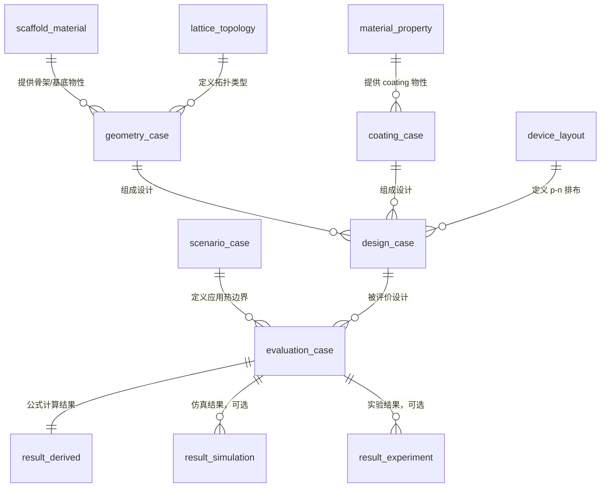

# 3D 骨架热电涂层器件数据库采集与结果计算规范

> 校对稿：本文件只讨论如何构建高质量数据库，暂不涉及机器学习训练。当前版本不考虑机械性能，只关注 3D 骨架、热电 coating、热边界、电学负载和热电输出结果。

## 1. 数据库目标

本数据库的基本单元不是“某个结构”本身，而是：

```text
一个 design_case 在一个 scenario_case 下的一次 evaluation
```

也就是：

```text
design_case = 3D 骨架 + coating + 器件排布
scenario_case = 热边界 + 冷却条件 + 负载条件 + 输出目标
evaluation_result = 该设计在该场景下的计算、仿真或实验结果
```

推荐的数据库关系为：



数据库应当严格区分三类数据：

```text
raw_input: 直接收集或测量的数据
derived_result: 由明确公式计算出的结果
validated_result: 来自 FEM 仿真或实验验证的结果
```

不要用 derived_result 覆盖 raw_input；不要把公式估算结果和仿真/实验结果混在一个字段里。每个结果都应记录 `result_source`：

```text
analytical_proxy / unit_cell_fem / full_device_fem / experiment
```

## 2. 数据优先级

建议将字段分成三个优先级。

```text
P0: 必须收集。没有这些字段，基础热电输出无法计算。
P1: 强烈建议收集。决定数据库质量，可显著提高结果可信度。
P2: 后续拓展。用于更复杂器件、误差分析或实验溯源。
```

## 3. 必须统一的单位

数据库内部建议全部使用 SI 单位。可以另建视图显示常用单位，例如 `um`、`mm`、`S/cm`、`uV/K`。

| 物理量 | 数据库单位 | 常用显示单位 |
| :--- | :--- | :--- |
| 温度 | `K` | `K` 或 `degC` |
| 长度 | `m` | `um`, `mm` |
| 面积 | `m^2` | `mm^2` |
| 体积 | `m^3` | `mm^3` |
| coating 厚度 | `m` | `um` |
| Seebeck 系数 | `V/K` | `uV/K` |
| 电导率 | `S/m` | `S/cm` |
| 热导率 | `W/(m K)` | `W/(m K)` |
| 电阻 | `ohm` | `ohm`, `kohm` |
| 热阻 | `K/W` | `K/W` |
| 热流密度 | `W/m^2` | `W/m^2` |
| 对流换热系数 | `W/(m^2 K)` | `W/(m^2 K)` |
| 功率 | `W` | `uW`, `mW` |
| 面积功率密度 | `W/m^2` | `uW/cm^2` |
| 效率 | dimensionless | `%` |

## 4. 需要收集的数据与建议范围

下面的范围是初始数据库建议范围，不是物理极限。后续可以根据材料体系和设备能力收窄。

### 4.0 当前项目已给定数据

本节来自 `assets/20260526(1).docx`，作为当前数据库的第一版项目取值。后续章节仍保留较宽的通用建议范围；实际建库时优先使用本节的项目范围。

#### 4.0.1 热电 coating 材料

| 字段 | 当前取值 | 单位 | 备注 |
| :--- | :--- | :--- | :--- |
| `material_pair` | Bi2Te3 (N), Sb2Te3 (P) | - | 当前只考虑一组 p-n 材料 |
| `carrier_type` | N, P | - | Bi2Te3 为 n 型，Sb2Te3 为 p 型 |
| `T_sample_range` | 288.15-523.15 | K | 物性采样/适用温度范围 |
| `S_n` | -155 | uV/K | n 型 Bi2Te3 |
| `S_p` | 100 | uV/K | p 型 Sb2Te3 |
| `sigma_n` | 40000 | S/m | docx 中 Sigma 行与 Seebeck 行重复，不能作为电导率使用 |
| `sigma_p` | 100000 | S/m | docx 中 Sigma 行与 Seebeck 行重复，不能作为电导率使用 |
| `kappa_coating` | 1 | W/(m K) | coating 热导率 |
| `T_max_valid` | 523.15 | K | docx 标注为 below 523.15 K |
| `deposition_method` | PVD | - | coating 工艺 |
| `density_n` | 7860 | kg/m^3 | Bi2Te3 |
| `density_p` | 6500 | kg/m^3 | Sb2Te3 |
| `uncertainty_S` | 0-10 | % | Seebeck 不确定度 |
| `uncertainty_sigma` | 0-15 | % | 电导率不确定度，待补真实 sigma 后使用 |
| `uncertainty_kappa` | 0-20 | % | 热导率不确定度 |

必须补充的数据：

```text
sigma_n
sigma_p
```

没有真实电导率时，`R_e`、`P_max`、`P_area`、`eta_load` 和 `eta_max` 都只能作为占位或使用文献估计值，不能作为高质量数据库结果。

#### 4.0.2 骨架/基底材料

| 字段 | 当前取值 | 单位 | 备注 |
| :--- | :--- | :--- | :--- |
| `scaffold_material_name` | PEGDA 或耐 300 degC 高温树脂 | - | 二选一，当前不考虑多种基材并行 |
| `is_electrically_insulating` | true | - | docx 明确不考虑基材电导率 |
| `sigma_scaffold` | 0 | S/m | 初始计算中视为绝缘 |
| `kappa_materials` | 0.25 | W/(m K) | 初定，待测 |
| `kappa_scaffold` | derived | W/(m K) | 可由几何体积分数和等效模型计算 |
| `T_min_valid` | 273.15 | K | 骨架适用温度下限 |
| `T_max_valid` | 523.15 | K | 骨架适用温度上限 |

当前约束：

```text
不考虑机械性能
不考虑基材导电
基材单一
```

#### 4.0.3 空隙/环境介质

| 字段 | 当前取值 | 单位 | 备注 |
| :--- | :--- | :--- | :--- |
| `void_medium` | air | - | 空腔为空气 |
| `kappa_void` | 0.026 | W/(m K) | 常温空气热导率 |
| `pressure` | 1 atm | - | 一个标准大气压 |
| `radiation_enabled` | false | - | 当前不考虑辐射 |
| `emissivity` | N/A | - | 因不考虑辐射，暂不需要 |

#### 4.0.4 3D 骨架几何范围

| 字段 | 当前取值范围 | 单位 | 备注 |
| :--- | :--- | :--- | :--- |
| `lattice_type` | FCC, BCC, Octet, Diamond, I-shaped, Hourglass, TO-derived, Cubic, Open cell, Hexa Truss | - | 也包括杆基桁架、空心框架/多面体单元、螺旋与手性结构；详细分类见下表 |
| `cell_size` | 0.5e-3 到 5e-3 | m | 单胞尺寸 |
| `strut_diameter` | 0.1e-3 到 1e-3 | m | 支柱直径；不允许小于 0.1 mm |
| `d_over_cell` | 0.02-2 | - | 来自 docx；大于 0.4 的组合需要制造性复核 |
| `N_x/N_y/N_z` | 1-20 | - | 阵列数量 |
| `L_device` | 0.5e-3 到 20e-3 | m | 热流方向长度 |
| `A_device` | 4e-6 到 4e-4 | m^2 | 器件投影面积 |
| `V_domain` | 2e-9 到 8e-6 | m^3 | 包络体积 |
| `V_scaffold` | 0.02-0.5 * V_domain | m^3 | 骨架实体体积 |
| `porosity` | 0.50-0.98 | - | 孔隙率 |
| `relative_density` | 0.02-0.50 | - | 相对密度 |
| `A_surface` | 1e-6 到 1e-4 | m^2 | 可 coating 表面积 |
| `surface_area_density` | 0.125-50000 | 1/m | `A_surface / V_domain` |
| `orientation` | x / y / z / thermal gradient | - | 结构方向 |
| `geometry_gradient_type` | none / asymmetric / custom | - | 梯度类型 |

##### 4.0.4.1 PVD 友好骨架模型库

下表来自当前模型设计识别，用于扩展 `lattice_type` 和 `geometry_family` 字段。核心原则是：优先选择开放杆系、通孔结构、无封闭腔体、视线可达的骨架，以提高 PVD coating 覆盖均匀性。

| 大类 | 具体结构 / 子类 | PVD 友好条件与备注 |
| :--- | :--- | :--- |
| 经典桁架 | SC, BCC, FCC, Octet, Diamond, Pyramidal, Tetrahedral, 3D Kagome, Cross-ply (0/90 层叠) | 全开放杆系，视线无遮挡；可叠加工字形、方形等截面优化。 |
| 空心框架单胞 | 空心立方体框架、空心八面体框架、空心菱形十二面体框架、开孔 Kelvin (截角八面体框架) | 仅保留棱边，内部完全中空，极度开放。 |
| 螺旋与手性 | 单螺旋阵列、双螺旋骨架、立方手性晶格、Cross-chiral lattice、螺旋编织网络 | 需约束螺距/杆径比 >= 2.5，保证螺旋内侧视线可达；适合引入声子散射与各向异性。 |
| 编织与纺织 | 3D 正交机织、角联锁编织、编织管阵 | 纤维状通孔，天然满足视线要求，柔韧性好。 |
| 拉胀开放杆系 | Re-entrant 六面体桁架、手性拉胀桁架、旋转刚体铰链网络 | 负泊松比，全杆件外露，无遮挡。 |
| 折纸/剪纸衍生骨架 | Miura-ori 杆骨架、Kresling 棱边骨架等 | 去除面保留棱边，形成全开放铰链网络。 |
| TPMS 骨架网络 | Gyroid 网络、Schwarz P 网络、I-WP 网络，均取单套互穿杆网络 | 无曲面，等同于连通的开杆骨架，可替代片状 TPMS。 |
| 直通孔道阵列 | 竖直圆柱孔阵列、方孔/六角孔通孔、倾斜平行孔阵列 | 孔方向与 PVD 入射方向夹角 <= 30 deg；蜂窝通孔属于此类。 |
| 组合/混合晶格 | 模块化组合：节点为空心框架、薄盘/板、多叉星、开口环；连杆为直杆、螺旋杆、波纹杆、工字截面杆、分形杆；拓扑为立方框架连接、BCC 节点 + 螺旋连杆、层状节点-螺旋阵列等 | 当前“薄立方体节点 + 四螺旋支柱”归属此类；需整体验证 PVD 视线可达性。 |
| TO-derived 生成方法 | 施加 PVD 可制造约束后由拓扑优化自动生成的结构，例如悬垂角 >= 45 deg、最大内凹深度限制、无封闭孔 | 不作为独立结构类型，而是探索全新拓扑的生成工具；产出结构应天然可镀。 |

建议数据库为该模型分类增加以下字段：

```text
geometry_family
geometry_subtype
node_type
connector_type
topology_rule
pvd_line_of_sight_flag
pvd_incidence_angle_max
pitch_to_diameter_ratio
open_cell_flag
closed_cavity_flag
support_free_flag
```

当前自定义模型可先填为：

| 字段 | 建议填充值 | 说明 |
| :--- | :--- | :--- |
| `geometry_family` | hybrid_lattice | 组合/混合晶格 |
| `geometry_subtype` | cube_node_four_helical_struts | 薄立方体节点 + 四螺旋支柱 |
| `node_type` | thin_cube_node | 薄立方体节点 |
| `connector_type` | helical_strut | 螺旋支柱 |
| `topology_rule` | cube_node_plus_four_helical_connectors | 节点-连杆式组合拓扑 |
| `pitch_to_diameter_ratio` | >= 2.5 | 螺旋内侧需保证视线可达 |
| `pvd_line_of_sight_flag` | to_be_verified | 需要通过几何射线检查或沉积仿真确认 |
| `pvd_incidence_angle_max` | <= 30 deg preferred | 对直通/倾斜孔道尤其重要，对螺旋结构作为参考约束 |
| `open_cell_flag` | true | 开放骨架 |
| `closed_cavity_flag` | false | 不允许封闭空腔 |
| `support_free_flag` | true | 应满足无支撑打印 |

打印工艺限制：

```text
无悬空结构：所有特征从打印平台向上生长，倾斜角 >= 45 deg
无需要支撑的悬垂面或弧形桥接
无直径小于 0.1 mm 的细柱或薄壁
模型支柱内部完全实心，无封闭空腔或排液孔
表面无密集微孔、倒刺或互锁结构
所有特征沿 Z 轴方向连贯，无孤岛部件
```

这些限制应写入 `geometry_case` 的制造性检查字段：

```text
printable_flag
min_feature_check
overhang_check
z_continuity_check
solid_strut_check
support_free_check
```

#### 4.0.5 Coating 工艺与覆盖范围

| 字段 | 当前取值范围 | 单位 | 备注 |
| :--- | :--- | :--- | :--- |
| `coating_materials` | Bi2Te3 (N), Sb2Te3 (P) | - | 与材料表一致 |
| `t_coating` | 5e-7 到 20e-7 | m | 即 0.5-2.0 um |
| `coverage_ratio` | 0.5-1 | - | coating 覆盖率 |
| `thickness_std_ratio` | 0-0.5 | - | 厚度不均匀性 |

当前建议扫描点：

```text
t_coating = 0.5, 1.0, 1.5, 2.0 um
```

#### 4.0.6 器件排布数据

| 字段 | 当前取值范围 | 单位 | 备注 |
| :--- | :--- | :--- | :--- |
| `N_parallel` | 0 in docx | - | docx 表示无并联热电单元；公式计算中建议存为 `has_parallel=false`, `N_parallel_effective=1` |
| `A_leg_p` | 4e-6 到 4e-4 | m^2 | p-leg 投影面积 |
| `A_leg_n` | 4e-6 到 4e-4 | m^2 | n-leg 投影面积 |
| `L_leg_p` | 0.5e-3 到 20e-3 | m | p-leg 长度 |
| `L_leg_n` | 0.5e-3 到 20e-3 | m | n-leg 长度 |
| `N_pair` | TBD | - | docx 未给出，需要补充 |
| `N_series` | TBD | - | docx 未给出，需要补充 |

注意：

```text
N_parallel = 0 不能直接进入 R_e = N_series * R_pair / N_parallel。
数据库中建议拆成 has_parallel=false 和 N_parallel_effective=1。
```

#### 4.0.7 总温度范围

| 字段 | 当前范围 | 单位 | 备注 |
| :--- | :--- | :--- | :--- |
| `T_hot_range` | 298.15-523.15 | K | 热端总体范围 |
| `T_cold_range` | 288.15-353.15 | K | 冷端总体范围 |
| `DeltaT_range` | 10-190 | K | 最小温差环境为皮肤，最大温差环境为工业废热 |

#### 4.0.8 场景 1：Wearable TEG

| 字段 | 当前取值 | 单位 | 备注 |
| :--- | :--- | :--- | :--- |
| `scenario_name` | Wearable TEG | - | 人体/穿戴式 |
| `boundary_type` | fixed_Th + natural_convection | - | 恒热，自然对流 |
| `T_hot_surface` | 303.15-308.15 | K | 皮肤侧热端 |
| `T_cold_env` | 293.15-298.15 | K | 环境温度 |
| `h_cold_static` | 5 | W/(m^2 K) | 静止自然对流 |
| `h_cold_active` | 15 | W/(m^2 K) | 运动时换热增强 |

推荐派生为两个 scenario_case：

```text
Wearable_TEG_static
Wearable_TEG_active
```

#### 4.0.9 场景 2：Pipe_car_waste_heat

| 字段 | 当前取值 | 单位 | 备注 |
| :--- | :--- | :--- | :--- |
| `scenario_name` | Pipe_car_waste_heat | - | 管道/车载废热 |
| `boundary_type` | fixed_Th + forced_convection | - | 恒热，强制对流 |
| `T_hot_surface` | 393.15-433.15 | K | 热端表面 |
| `T_cold_env` | 293.15-313.15 | K | 空气温度 |
| `h_cold_static` | 10 | W/(m^2 K) | 静止时自然对流 |
| `h_cold_active` | 100 | W/(m^2 K) | 启动/流动时换热增强 |

推荐派生为两个 scenario_case：

```text
Pipe_car_waste_heat_static
Pipe_car_waste_heat_active
```

#### 4.0.10 场景 3：Industrial_waste_heat

| 字段 | 当前取值 | 单位 | 备注 |
| :--- | :--- | :--- | :--- |
| `scenario_name` | Industrial_waste_heat | - | 工业废热 |
| `boundary_type` | fixed_Th + natural_convection | - | 恒热，自然对流 |
| `T_hot_surface` | 453.15-493.15 | K | 热端表面 |
| `T_cold_env` | 303.15-323.15 | K | 环境温度 |
| `h_cold` | 15 | W/(m^2 K) | 自然对流 |

#### 4.0.11 场景 4：Laptop_CPU/GPU

| 字段 | 当前取值 | 单位 | 备注 |
| :--- | :--- | :--- | :--- |
| `scenario_name` | Laptop_CPU/GPU | - | 芯片散热/低品位热源 |
| `boundary_type` | fixed_q + forced_convection | - | docx 写作 fixed_q natural_convection h，但备注为强制风扇对流散热 |
| `q_hot` | 10000 | W/m^2 | docx 中带问号，需要确认 |
| `T_hot_surface` | 313.15-333.15 | K | docx 中带问号，需要确认是否作为上限约束而非边界输入 |
| `T_cold_env` | 303.15-313.15 | K | 环境温度 |
| `h_cold` | 100 | W/(m^2 K) | 强制风扇对流 |

需要确认：

```text
q_hot = 10000 W/m^2 是否为固定输入热流
T_hot_surface = 313.15-333.15 K 是否为热端温度约束
boundary_type 应为 fixed_q + forced_convection，而不是 natural_convection
```

#### 4.0.12 当前待确认数据

| 项目 | 问题 | 对计算的影响 |
| :--- | :--- | :--- |
| `sigma_n`, `sigma_p` | docx 中 Sigma 行重复了 Seebeck 数值 | 无法可靠计算 `R_e`, `P_max`, `P_area`, `eta_max` |
| `N_pair`, `N_series` | docx 未提供 | 无法计算总电压和总内阻 |
| `N_parallel` | docx 写 0 | 公式中不能除以 0，建议改为 `has_parallel=false`, `N_parallel_effective=1` |
| `Laptop_CPU/GPU q_hot` | 带问号 | 需要确认是否固定热流输入 |
| `Laptop_CPU/GPU T_hot_surface` | 带问号 | 需要确认是边界温度还是温度上限 |
| `d_over_cell` | 范围到 2 | 可能意味着支柱直径大于单胞尺寸，需要制造性筛选 |

### 4.1 热电 coating 材料物性

每一种 coating 材料应至少记录 p 型和 n 型材料的温度相关物性。如果暂时没有温度曲线，至少要记录参考温度 `T_ref` 下的常数值。

| 字段 | 优先级 | 建议范围 | 单位 | 说明 |
| :--- | :--- | :--- | :--- | :--- |
| `material_id` | P0 | - | - | 材料编号 |
| `material_name` | P0 | Bi2Te3, Sb2Te3, PbTe, Cu2Se, BiSbTe 等 | - | coating 材料名称 |
| `carrier_type` | P0 | `p` / `n` | - | p 型或 n 型 |
| `T_sample` | P0 | 250-900 | K | 物性采样温度 |
| `S` | P0 | -300 到 +300 | uV/K | signed Seebeck 系数，p 型为正，n 型为负 |
| `sigma` | P0 | 1e3-2e5 | S/m | coating 电导率 |
| `kappa` | P0 | 0.1-5 | W/(m K) | coating 热导率 |
| `T_min_valid` | P0 | 250-900 | K | 材料适用最低温度 |
| `T_max_valid` | P0 | 300-1000 | K | 材料适用最高温度 |
| `deposition_method` | P1 | evaporation, sputtering, electrodeposition 等 | - | coating 制备方式 |
| `film_density` | P2 | 5000-9000 | kg/m^3 | 用于质量或体积功率密度 |
| `grain_size` | P2 | 5-200 | nm | 影响薄膜热导率和电导率 |
| `measurement_source` | P1 | literature / measured / fitted | - | 数据来源 |
| `uncertainty_S` | P2 | 0-20 | % | 测量或拟合不确定度 |
| `uncertainty_sigma` | P2 | 0-30 | % | 测量或拟合不确定度 |
| `uncertainty_kappa` | P2 | 0-30 | % | 测量或拟合不确定度 |

建议初始材料范围：

```text
低温体系: Bi2Te3 / Sb2Te3 / BiSbTe, 293-550 K
中温体系: PbTe / MgAgSb / Mg3Bi2, 400-750 K
高温体系: half-Heusler / skutterudite / Cu2Se, 600-900 K
```

初始阶段可以先聚焦 2023 年文章相关的：

```text
p-type: Sb2Te3
n-type: Bi2Te3
coating thickness: around 1 um, then expand to 0.1-5 um
```

### 4.2 骨架/基底物性

虽然当前不考虑机械性能，骨架的热导率和电导率仍然需要记录，因为它会影响寄生导热和是否存在并联导电路径。

| 字段 | 优先级 | 建议范围 | 单位 | 说明 |
| :--- | :--- | :--- | :--- | :--- |
| `scaffold_material_id` | P0 | - | - | 骨架材料编号 |
| `scaffold_material_name` | P0 | PEGDA, carbonized PEGDA, resin, ceramic 等 | - | 骨架材料名称 |
| `kappa_scaffold` | P0 | 0.02-2 | W/(m K) | 骨架热导率 |
| `sigma_scaffold` | P1 | 0-1e3 | S/m | 骨架电导率，若绝缘可设为 0 |
| `T_min_valid` | P1 | 250-900 | K | 骨架适用最低温度 |
| `T_max_valid` | P1 | 300-1000 | K | 骨架适用最高温度 |
| `is_electrically_insulating` | P0 | true / false | - | 是否在电学模型中忽略骨架导电 |
| `density_s` | P2 | 500-3000 | kg/m^3 | 用于质量相关结果 |

建议规则：

```text
如果 sigma_scaffold / sigma_coat < 1e-4，可以在初始电学计算中忽略骨架导电。
如果骨架部分碳化后存在明显导电性，需要保留 sigma_scaffold 并计算并联电通路。
```

### 4.3 空隙/环境介质物性

3D 骨架内部通常为空气、惰性气体或近似真空。空隙热导率会影响低孔隙率和微温差场景。

| 字段 | 优先级 | 建议范围 | 单位 | 说明 |
| :--- | :--- | :--- | :--- | :--- |
| `void_medium` | P0 | air / vacuum / inert_gas | - | 空隙介质 |
| `kappa_void` | P0 | 0-0.08 | W/(m K) | 空隙热导率，空气常温约 0.026 |
| `pressure` | P2 | 1e-3-1e5 | Pa | 若涉及真空或低压 |
| `radiation_enabled` | P2 | true / false | - | 高温时是否考虑辐射 |
| `emissivity` | P2 | 0.1-0.95 | - | 高温辐射参数 |

### 4.4 3D 骨架几何数据

几何数据是这个数据库最关键的部分。建议尽量从 CAD 或 mesh 中直接导出，而不是只记录拓扑名称。

| 字段 | 优先级 | 建议范围 | 单位 | 说明 |
| :--- | :--- | :--- | :--- | :--- |
| `geometry_id` | P0 | - | - | 几何编号 |
| `lattice_type` | P0 | FCC, BCC, Octet, Diamond, Gyroid, Schwarz-P, I-shape, hourglass, TO-derived | - | 拓扑类型 |
| `cell_size_x/y/z` | P0 | 0.2e-3 到 5e-3 | m | 单胞尺寸 |
| `strut_diameter` | P0 | 0.03e-3 到 1e-3 | m | 支柱直径或等效壁厚 |
| `d_over_cell` | P1 | 0.03-0.40 | - | 支柱直径/单胞尺寸 |
| `N_x/N_y/N_z` | P0 | 1-20 | - | 单胞阵列数 |
| `L_device` | P0 | 0.5e-3 到 20e-3 | m | 热流方向厚度 |
| `A_device` | P0 | 1e-6 到 1e-3 | m^2 | 投影面积 |
| `V_domain` | P0 | 5e-10 到 2e-5 | m^3 | 包络体积，通常为 `A_device * L_device` |
| `V_scaffold` | P0 | 0.02-0.50 * V_domain | m^3 | 骨架实体体积 |
| `porosity` | P0 | 0.50-0.98 | - | 孔隙率 |
| `relative_density` | P0 | 0.02-0.50 | - | 相对密度，约等于 `1 - porosity` |
| `A_surface` | P0 | 1e-5 到 1e-1 | m^2 | 可 coating 的骨架表面积 |
| `surface_area_density` | P1 | 500-30000 | 1/m | `A_surface / V_domain` |
| `orientation` | P1 | x / y / z / custom | - | 热流方向相对于点阵方向 |
| `geometry_gradient_type` | P1 | none / I-shape / hourglass / asymmetric / custom | - | 沿热流方向的截面变化 |
| `min_feature_size` | P1 | 20e-6 到 500e-6 | m | 打印/沉积可制造性检查 |
| `mesh_file` | P2 | STL / STEP / mesh | - | 几何文件路径 |
| `cad_source` | P2 | script / CAD / topology_optimization | - | 几何来源 |

推荐初始采样范围：

```text
lattice_type: FCC, Diamond, Gyroid, hourglass
cell_size: 0.5, 1.0, 1.5, 2.0 mm
strut_diameter: 50, 100, 200, 400 um
porosity: 0.70-0.95
N_z: 4-8
L_device: 3-10 mm
```

### 4.5 Coating 工艺与覆盖数据

coating 是导电和热电转换的主体，因此不能只记录材料名，还要记录厚度、覆盖率和界面损耗。

| 字段 | 优先级 | 建议范围 | 单位 | 说明 |
| :--- | :--- | :--- | :--- | :--- |
| `coating_case_id` | P0 | - | - | coating case 编号 |
| `material_id` | P0 | - | - | 对应材料 |
| `t_coating` | P0 | 0.05e-6 到 10e-6 | m | coating 厚度 |
| `coverage_ratio` | P1 | 0.50-1.00 | - | 实际覆盖面积/理论可覆盖面积 |
| `thickness_std_ratio` | P1 | 0-0.50 | - | 厚度不均匀性，标准差/均值 |
| `R_contact_area` | P1 | 1e-10 到 1e-5 | ohm m^2 | 电接触面积电阻 |
| `R_th_contact_area` | P1 | 1e-7 到 1e-3 | m^2 K/W | 热接触面积热阻 |
| `oxidation_flag` | P2 | true / false | - | 是否有明显氧化 |
| `deposition_rate` | P2 | 0.01e-9 到 10e-9 | m/s | 沉积速率 |
| `annealing_temperature` | P2 | 293-800 | K | 退火温度 |

推荐初始厚度范围：

```text
t_coating: 0.1, 0.3, 0.5, 1.0, 2.0, 5.0 um
```

对薄 coating，可用近似：

```text
V_coating ≈ A_surface * t_coating * coverage_ratio
```

该公式要求：

```text
t_coating << strut_diameter
```

如果 `t_coating / strut_diameter > 0.05`，建议用 CAD 或 mesh 重新计算 coating 体积，而不是继续使用薄壳近似。

### 4.6 器件排布数据

器件排布决定总电压、总内阻和热导通道数量。

| 字段 | 优先级 | 建议范围 | 单位 | 说明 |
| :--- | :--- | :--- | :--- | :--- |
| `layout_id` | P0 | - | - | 排布编号 |
| `N_pair` | P0 | 1-100 | - | p-n 热电对数量 |
| `N_series` | P0 | 1-100 | - | 串联热电对数量 |
| `N_parallel` | P0 | 1-20 | - | 并联支路数量 |
| `A_leg_p` | P0 | 1e-8 到 1e-4 | m^2 | p-leg 投影面积 |
| `A_leg_n` | P0 | 1e-8 到 1e-4 | m^2 | n-leg 投影面积 |
| `L_leg_p` | P0 | 0.5e-3 到 20e-3 | m | p-leg 热流方向长度 |
| `L_leg_n` | P0 | 0.5e-3 到 20e-3 | m | n-leg 热流方向长度 |
| `electrode_material` | P1 | Ni, Cu, Ag, Au 等 | - | 电极材料 |
| `R_electrode` | P1 | 0-10 | ohm | 电极和连接线电阻 |
| `packing_fraction` | P1 | 0.05-0.90 | - | 热电 leg 投影面积/器件总面积 |

如果早期只做单个等效 core-shell leg，可设：

```text
N_pair = 1
N_series = 1
N_parallel = 1
A_leg_p + A_leg_n = A_device * packing_fraction
```

### 4.7 应用场景与热边界数据

场景不要只记录名称，必须记录可计算的热边界。

| 字段 | 优先级 | 建议范围 | 单位 | 说明 |
| :--- | :--- | :--- | :--- | :--- |
| `scenario_id` | P0 | - | - | 场景编号 |
| `scenario_name` | P0 | wearable / pipe_waste_heat / industrial / fixed_T 等 | - | 场景名称 |
| `boundary_type` | P0 | fixed_T / fixed_q / convection / mixed | - | 热边界类型 |
| `T_hot_surface` | P0/P1 | 293-900 | K | 直接施加在器件热端表面的温度 |
| `T_cold_surface` | P0/P1 | 273-400 | K | 直接施加在器件冷端表面的温度 |
| `T_hot_env` | P0/P1 | 293-1000 | K | 热端环境温度 |
| `T_cold_env` | P0/P1 | 273-400 | K | 冷端环境温度 |
| `q_hot` | P0/P1 | 10-50000 | W/m^2 | 热端输入热流密度 |
| `h_hot` | P0/P1 | 2-5000 | W/(m^2 K) | 热端换热系数 |
| `h_cold` | P0/P1 | 2-5000 | W/(m^2 K) | 冷端换热系数 |
| `R_load` | P1 | 0.01-1e7 | ohm | 指定负载电阻 |
| `load_scan_min_ratio` | P1 | 0.01 | - | 负载扫描下限，`R_load/R_e` |
| `load_scan_max_ratio` | P1 | 100 | - | 负载扫描上限，`R_load/R_e` |
| `target_type` | P0 | V_oc / P_max / P_area / eta_max / Q_loss | - | 评价目标 |

不同场景的建议初始范围：

| 场景 | 关键参数 | 建议范围 |
| :--- | :--- | :--- |
| wearable low-grade heat | `T_hot_env` | 305-315 K |
| wearable low-grade heat | `T_cold_env` | 293-303 K |
| wearable low-grade heat | `h_cold` | 2-15 W/(m^2 K) |
| wearable low-grade heat | `q_hot` | 20-200 W/m^2 |
| pipe waste heat | `T_hot_env` | 350-650 K |
| pipe waste heat | `q_hot` | 500-10000 W/m^2 |
| pipe waste heat | `h_cold` | 10-300 W/(m^2 K) |
| industrial high heat flux | `T_hot_env` | 600-900 K |
| industrial high heat flux | `q_hot` | 10000-50000 W/m^2 |
| industrial high heat flux | `h_cold` | 100-5000 W/(m^2 K) |
| fixed temperature test | `T_hot_surface` | 320-600 K |
| fixed temperature test | `T_cold_surface` | 293-323 K |

重要规则：

```text
每个 evaluation_case 都必须检查 T_hot/T_cold/T_avg 是否落在 coating 材料的 valid_temperature_range 内。
如果超出材料适用温度，result_valid=false，并记录 invalid_reason。
```

## 5. 几何派生量计算

这些结果主要从 CAD、mesh 或基础几何字段计算得到。

### 5.1 包络体积

```text
V_domain = A_device * L_device
```

### 5.2 相对密度与孔隙率

如果 CAD 已给出骨架体积：

```text
relative_density = V_scaffold / V_domain
porosity = 1 - relative_density
```

如果 coating 体积不可忽略：

```text
porosity_after_coating = 1 - (V_scaffold + V_coating) / V_domain
```

### 5.3 Coating 体积

薄壳近似：

```text
V_coating = A_surface * t_coating * coverage_ratio
```

coating 体积分数：

```text
f_coat = V_coating / V_domain
```

骨架体积分数：

```text
f_scaffold = V_scaffold / V_domain
```

空隙体积分数：

```text
f_void = 1 - f_scaffold - f_coat
```

### 5.4 比表面积

```text
surface_area_density = A_surface / V_domain
```

这个字段很重要，因为 coating 的有效体积和导电通道数量都直接依赖表面积。

## 6. 等效材料参数计算

等效参数可以有两种来源：

```text
analytical_proxy: 由公式快速估算
unit_cell_fem/full_device_fem: 由有限元均匀化或整器件仿真得到
```

高质量数据库建议同时保留两套字段：

```text
kappa_eff_proxy, sigma_eff_proxy, S_eff_proxy
kappa_eff_fem, sigma_eff_fem, S_eff_fem
```

### 6.1 等效热导率

初始解析近似：

```text
kappa_eff =
  g_k_scaffold * f_scaffold * kappa_scaffold
  + g_k_coat * f_coat * kappa_coat
  + g_k_void * f_void * kappa_void
```

其中：

```text
g_k_scaffold, g_k_coat, g_k_void
```

是几何方向因子，用来表示点阵在热流方向上的连通性。初始数据库可以先设为 1，但更推荐通过 unit-cell FEM 标定。

建议范围：

```text
g_k_*: 0.01-2
kappa_eff: 0.01-5 W/(m K)
```

如果有 FEM 均匀化，应优先使用：

```text
kappa_eff = Q * L_device / (A_device * DeltaT)
```

其中 `Q` 是仿真得到的稳态热流。

### 6.2 等效电导率

如果骨架绝缘，电流主要走 coating：

```text
sigma_eff =
  g_sigma_coat * f_coat * coverage_ratio * sigma_coat
```

如果骨架存在导电性：

```text
sigma_eff =
  g_sigma_coat * f_coat * coverage_ratio * sigma_coat
  + g_sigma_scaffold * f_scaffold * sigma_scaffold
```

其中 `g_sigma_*` 是电流方向上的几何连通性因子。

也可以使用支柱尺度近似：

```text
sigma_eff ≈ C_net * (t_coating / strut_diameter) * sigma_coat
```

建议范围：

```text
C_net: 0.01-1
g_sigma_coat: 0.01-2
sigma_eff: 1-1e5 S/m
```

若使用电学 FEM：

```text
sigma_eff = I * L_device / (A_device * DeltaV)
```

### 6.3 等效 Seebeck 系数

如果单个 leg 只包覆一种热电材料，且温度分布近似均匀：

```text
S_eff ≈ S_coat(T_avg)
```

其中：

```text
T_avg = (T_hot_device + T_cold_device) / 2
```

如果考虑温度相关物性和非均匀温度梯度：

```text
S_eff = integral[S_coat(T(z)) * dT/dz dz] / DeltaT_device
```

对 p-n 热电对：

```text
alpha_pair = S_p_eff - S_n_eff
```

其中 `S_n_eff` 是 signed value，通常为负，因此 `alpha_pair` 为正。

含 `N_series` 个串联热电对时：

```text
alpha_device = N_series * alpha_pair
```

若存在并联支路，并联不会提高开路电压，但会降低总内阻。

### 6.4 等效 power factor 与 zT

材料等效指标：

```text
power_factor_eff = S_eff^2 * sigma_eff
zT_eff = S_eff^2 * sigma_eff * T_avg / kappa_eff
```

器件等效指标：

```text
Z_device = alpha_device^2 / (R_e * K_TE)
ZT_device = Z_device * T_avg
```

其中：

```text
K_TE = 1 / R_TE
```

## 7. 热阻、电阻与边界条件计算

### 7.1 器件热阻

等效热阻：

```text
R_TE_bulk = L_device / (kappa_eff * A_device)
```

加入界面热阻：

```text
R_TE =
  R_TE_bulk
  + R_th_contact_hot_area / A_device
  + R_th_contact_cold_area / A_device
```

热导：

```text
K_TE = 1 / R_TE
```

### 7.2 器件电阻

等效电阻近似：

```text
R_leg = L_electrical_path / (sigma_eff * A_electrical_path)
```

若只有器件尺度等效参数：

```text
R_leg ≈ L_device / (sigma_eff * A_device)
```

单个 p-n pair：

```text
R_pair = R_p + R_n + R_contact_p + R_contact_n + R_electrode_pair
```

串并联后：

```text
R_e = N_series * R_pair / N_parallel + R_electrode_total
```

若使用接触面积电阻：

```text
R_contact = R_contact_area / A_contact
```

### 7.3 外部热阻

对流热阻：

```text
R_hot_ext = 1 / (h_hot * A_device)
R_cold_ext = 1 / (h_cold * A_device)
```

总外部热阻：

```text
R_external = R_hot_ext + R_cold_ext
```

热阻匹配指标：

```text
thermal_resistance_ratio = R_TE / R_external
thermal_mismatch = abs(log(R_TE / R_external))
```

推荐同时存储：

```text
R_TE
R_external
thermal_resistance_ratio
thermal_mismatch
```

## 8. 不同场景下的 DeltaT 与 Q_hot 计算

需要区分“表面固定温度”和“环境固定温度”。如果温度直接施加在器件两侧表面，用 `T_hot_surface` 和 `T_cold_surface`；如果给的是外部环境温度，则需要考虑对流热阻。

### 8.1 固定表面温差 fixed_T

```text
T_hot_device = T_hot_surface
T_cold_device = T_cold_surface
DeltaT_device = T_hot_device - T_cold_device
```

开路导热热流：

```text
Q_cond_open = K_TE * DeltaT_device
```

### 8.2 固定热流 fixed_q

```text
Q_hot_input = q_hot * A_device
DeltaT_device ≈ Q_hot_input * R_TE
```

如果冷端温度已知：

```text
T_cold_device = T_cold_surface
T_hot_device = T_cold_device + DeltaT_device
```

如果热端温度超过材料有效温度范围，应标记无效：

```text
result_valid = false
invalid_reason = temperature_out_of_material_range
```

### 8.3 双侧对流 convection

```text
Q_hot_input =
  (T_hot_env - T_cold_env) /
  (R_hot_ext + R_TE + R_cold_ext)
```

器件实际温差：

```text
DeltaT_device = Q_hot_input * R_TE
```

器件表面温度：

```text
T_hot_device = T_hot_env - Q_hot_input * R_hot_ext
T_cold_device = T_cold_env + Q_hot_input * R_cold_ext
```

### 8.4 混合边界 mixed

常见情况是热端固定热流，冷端对流：

```text
Q_hot_input = q_hot * A_device
T_cold_device = T_cold_env + Q_hot_input * R_cold_ext
T_hot_device = T_cold_device + Q_hot_input * R_TE
DeltaT_device = Q_hot_input * R_TE
```

如果热端固定温度，冷端对流：

```text
Q_hot_input = (T_hot_surface - T_cold_env) / (R_TE + R_cold_ext)
DeltaT_device = Q_hot_input * R_TE
T_cold_device = T_cold_env + Q_hot_input * R_cold_ext
```

## 9. 电输出与效率结果计算

以下公式用于每个 `evaluation_case`。

### 9.1 开路电压

```text
V_oc = alpha_device * DeltaT_device
```

### 9.2 指定负载下的电流、电压和功率

```text
I_load = V_oc / (R_e + R_load)
V_load = I_load * R_load
P_load = I_load^2 * R_load
```

等价写法：

```text
P_load = V_oc^2 * R_load / (R_e + R_load)^2
```

### 9.3 最大功率

最大功率发生在：

```text
R_load = R_e
```

因此：

```text
P_max = V_oc^2 / (4 * R_e)
I_at_P_max = V_oc / (2 * R_e)
R_load_at_P_max = R_e
```

面积功率密度：

```text
P_area = P_max / A_device
```

体积功率密度：

```text
P_volume = P_max / V_domain
```

### 9.4 输入热量

更完整的热电热端输入为：

```text
Q_hot =
  alpha_device * T_hot_device * I_load
  - 0.5 * I_load^2 * R_e
  + K_TE * DeltaT_device
```

冷端排热：

```text
Q_cold =
  alpha_device * T_cold_device * I_load
  + 0.5 * I_load^2 * R_e
  + K_TE * DeltaT_device
```

能量守恒检查：

```text
Q_hot - Q_cold ≈ P_load
```

数据库中建议存储能量守恒误差：

```text
energy_balance_error = abs((Q_hot - Q_cold - P_load) / Q_hot)
```

### 9.5 转换效率

指定负载效率：

```text
eta_load = P_load / Q_hot
```

最大功率点效率：

```text
eta_at_P_max = P_max / Q_hot_at_P_max
```

### 9.6 最大效率 eta_max

推荐方法：对负载比进行扫描。

```text
m = R_load / R_e
scan m from 0.01 to 100
for each m:
  R_load = m * R_e
  I_load = V_oc / (R_e + R_load)
  P_load = I_load^2 * R_load
  Q_hot = alpha_device * T_hot_device * I_load
          - 0.5 * I_load^2 * R_e
          + K_TE * DeltaT_device
  eta_load = P_load / Q_hot
eta_max = max(eta_load)
R_load_at_eta_max = R_load where eta_load is maximum
```

如果使用常物性热电器件近似，也可以用闭式公式：

```text
T_avg = (T_hot_device + T_cold_device) / 2
ZT_device = alpha_device^2 * T_avg / (R_e * K_TE)
eta_max =
  (DeltaT_device / T_hot_device)
  * (sqrt(1 + ZT_device) - 1)
  / (sqrt(1 + ZT_device) + T_cold_device / T_hot_device)
```

对应的最大效率负载比近似为：

```text
m_eta = sqrt(1 + ZT_device)
R_load_at_eta_max = m_eta * R_e
```

建议数据库同时记录：

```text
eta_max
eta_max_method: load_scan / closed_form
R_load_at_eta_max
m_eta
```

### 9.7 热泄漏与有效温差保持

开路导热泄漏：

```text
Q_leak_open = K_TE * DeltaT_device
```

单位面积热泄漏：

```text
q_leak_open = Q_leak_open / A_device
```

温差保持比例：

```text
DeltaT_source = T_hot_env - T_cold_env
DeltaT_retention = DeltaT_device / DeltaT_source
```

如果是固定表面温差场景：

```text
DeltaT_retention = 1
```

## 10. 最终需要保存的 results

建议把 results 分成四组。

### 10.1 几何派生 results

| result 字段 | 单位 | 来源 | 是否必须 |
| :--- | :--- | :--- | :--- |
| `V_domain` | m^3 | `A_device * L_device` | P0 |
| `V_coating` | m^3 | `A_surface * t_coating * coverage_ratio` | P0 |
| `f_scaffold` | - | `V_scaffold / V_domain` | P0 |
| `f_coat` | - | `V_coating / V_domain` | P0 |
| `f_void` | - | `1 - f_scaffold - f_coat` | P0 |
| `surface_area_density` | 1/m | `A_surface / V_domain` | P1 |
| `porosity_after_coating` | - | formula | P1 |

### 10.2 等效物性 results

| result 字段 | 单位 | 来源 | 是否必须 |
| :--- | :--- | :--- | :--- |
| `S_p_eff` | V/K | formula / FEM / experiment | P0 |
| `S_n_eff` | V/K | formula / FEM / experiment | P0 |
| `alpha_pair` | V/K | `S_p_eff - S_n_eff` | P0 |
| `alpha_device` | V/K | `N_series * alpha_pair` | P0 |
| `sigma_eff` | S/m | formula / FEM / experiment | P0 |
| `kappa_eff` | W/(m K) | formula / FEM / experiment | P0 |
| `power_factor_eff` | W/(m K^2) | `S_eff^2 * sigma_eff` | P1 |
| `zT_eff` | - | `S_eff^2 * sigma_eff * T_avg / kappa_eff` | P1 |
| `ZT_device` | - | `alpha_device^2 * T_avg / (R_e * K_TE)` | P1 |

### 10.3 热-电路 results

| result 字段 | 单位 | 来源 | 是否必须 |
| :--- | :--- | :--- | :--- |
| `R_TE` | K/W | formula / FEM | P0 |
| `K_TE` | W/K | `1 / R_TE` | P0 |
| `R_e` | ohm | formula / measurement | P0 |
| `R_contact_total` | ohm | contact fields | P1 |
| `R_hot_ext` | K/W | `1 / (h_hot * A_device)` | P1 |
| `R_cold_ext` | K/W | `1 / (h_cold * A_device)` | P1 |
| `R_external` | K/W | `R_hot_ext + R_cold_ext` | P1 |
| `thermal_resistance_ratio` | - | `R_TE / R_external` | P1 |
| `thermal_mismatch` | - | `abs(log(R_TE / R_external))` | P1 |

### 10.4 场景性能 results

| result 字段 | 单位 | 来源 | 是否必须 |
| :--- | :--- | :--- | :--- |
| `T_hot_device` | K | boundary calculation | P0 |
| `T_cold_device` | K | boundary calculation | P0 |
| `T_avg` | K | average | P0 |
| `DeltaT_device` | K | boundary calculation | P0 |
| `Q_hot_input` | W | boundary calculation | P0 |
| `Q_leak_open` | W | `K_TE * DeltaT_device` | P1 |
| `q_leak_open` | W/m^2 | `Q_leak_open / A_device` | P1 |
| `V_oc` | V | `alpha_device * DeltaT_device` | P0 |
| `I_load` | A | load calculation | P1 |
| `V_load` | V | `I_load * R_load` | P1 |
| `P_load` | W | `I_load^2 * R_load` | P1 |
| `P_max` | W | `V_oc^2 / (4 * R_e)` | P0 |
| `P_area` | W/m^2 | `P_max / A_device` | P0 |
| `P_volume` | W/m^3 | `P_max / V_domain` | P1 |
| `Q_hot` | W | thermoelectric heat equation | P0 |
| `Q_cold` | W | thermoelectric heat equation | P1 |
| `eta_load` | - | `P_load / Q_hot` | P1 |
| `eta_at_P_max` | - | max-power point calculation | P1 |
| `eta_max` | - | load scan or closed form | P0 |
| `R_load_at_eta_max` | ohm | load scan or closed form | P1 |
| `DeltaT_retention` | - | `DeltaT_device / DeltaT_source` | P1 |
| `energy_balance_error` | - | conservation check | P1 |
| `result_valid` | boolean | validation rule | P0 |
| `invalid_reason` | text | validation rule | P0 if invalid |

## 11. 推荐的初始数据库矩阵

为了先得到一批高质量数据，不建议一开始把变量空间铺得过大。建议采用小而完整的矩阵。

### 11.1 设计变量矩阵

```text
lattice_type:
  FCC, Gyroid, Diamond, hourglass

cell_size:
  0.5, 1.0, 1.5, 2.0 mm

strut_diameter:
  50, 100, 200, 400 um

coating_material_pair:
  p-Sb2Te3 / n-Bi2Te3

t_coating:
  0.1, 0.3, 0.5, 1.0, 2.0, 5.0 um

N_pair:
  1, 5, 10
```

### 11.2 场景矩阵

```text
fixed_T:
  T_hot_surface = 350, 450, 550 K
  T_cold_surface = 293, 323 K

wearable:
  T_hot_env = 310 K
  T_cold_env = 298 K
  h_cold = 5, 10, 15 W/(m^2 K)

pipe_waste_heat:
  q_hot = 1000, 5000, 10000 W/m^2
  h_cold = 50, 100, 300 W/(m^2 K)

industrial:
  q_hot = 10000, 30000, 50000 W/m^2
  h_cold = 300, 1000, 3000 W/(m^2 K)
```

初始阶段可以先只做：

```text
4 lattice types
4 strut diameters
6 coating thicknesses
3 fixed_T cases
3 pipe_waste_heat cases
```

这样已经可以形成一个清楚的数据库闭环。

## 12. 数据质量检查

每条 `evaluation_case` 写入 results 前，建议做以下检查。

### 12.1 几何检查

```text
V_domain > 0
A_device > 0
L_device > 0
0 < porosity < 1
0 < f_scaffold < 1
0 <= f_coat < 1
f_scaffold + f_coat <= 1
t_coating / strut_diameter < 0.05 for thin-shell approximation
```

### 12.2 温度检查

```text
T_hot_device > T_cold_device
T_avg within material valid range
T_hot_device <= min(T_max_valid_p, T_max_valid_n, T_max_valid_scaffold)
T_cold_device >= max(T_min_valid_p, T_min_valid_n, T_min_valid_scaffold)
```

### 12.3 电热检查

```text
R_e > 0
R_TE > 0
K_TE > 0
Q_hot > 0
P_max >= 0
0 <= eta_load <= Carnot_efficiency
0 <= eta_max <= Carnot_efficiency
```

其中：

```text
Carnot_efficiency = DeltaT_device / T_hot_device
```

### 12.4 能量守恒检查

```text
energy_balance_error < 1e-3 for analytical calculation
energy_balance_error < 5e-2 for FEM/experiment-derived results
```

### 12.5 来源检查

每个 result 必须记录：

```text
result_source
calculation_method
input_version
created_at
notes
```

## 13. 最小可行数据库字段清单

如果想先快速搭建数据库，最低限度要收集这些字段。

### 13.1 raw input 最小字段

```text
material:
  material_name
  carrier_type
  T_sample
  S
  sigma
  kappa
  T_min_valid
  T_max_valid

geometry:
  lattice_type
  cell_size
  strut_diameter
  N_x, N_y, N_z
  A_device
  L_device
  V_scaffold
  A_surface
  porosity

coating:
  material_id
  t_coating
  coverage_ratio
  R_contact_area
  R_th_contact_area

layout:
  N_pair
  N_series
  N_parallel
  A_leg_p
  A_leg_n
  L_leg_p
  L_leg_n

scenario:
  boundary_type
  T_hot_surface or T_hot_env
  T_cold_surface or T_cold_env
  q_hot
  h_hot
  h_cold
  R_load
```

### 13.2 derived result 最小字段

```text
geometry results:
  V_domain
  V_coating
  f_scaffold
  f_coat
  f_void
  surface_area_density

equivalent properties:
  S_p_eff
  S_n_eff
  alpha_device
  sigma_eff
  kappa_eff
  ZT_device

thermal/electrical circuit:
  R_TE
  K_TE
  R_e
  R_external
  thermal_mismatch

scenario performance:
  T_hot_device
  T_cold_device
  DeltaT_device
  V_oc
  P_max
  P_area
  Q_hot
  Q_leak_open
  eta_at_P_max
  eta_max
  result_valid
```

## 14. 建议的数据库建设顺序

推荐按下面顺序推进：

```text
1. 建 material_property 表，先录入 p-Sb2Te3 和 n-Bi2Te3 的 S/sigma/kappa 温度数据。
2. 建 geometry_case 表，从 CAD 或脚本导出 V_scaffold、A_surface、porosity。
3. 建 coating_case 表，扫描 t_coating = 0.1-5 um。
4. 建 scenario_case 表，先做 fixed_T、wearable、pipe_waste_heat 三类场景。
5. 建 evaluation_case 表，生成 design_case x scenario_case 的组合。
6. 用本文件公式计算 result_derived。
7. 对少量代表点做 FEM 或实验，写入 result_simulation/result_experiment。
8. 比较 proxy result 与 validated result，修正几何因子 g_k、g_sigma、C_net。
```

这样可以先得到一个“干净、可解释、可复算”的数据库，再逐步提高物理精度。


| Thermal           |                           |                          |
| ----------------- | ------------------------- | ------------------------ |
| carrier_type      | Bi_2Te_3 (n type)         | Sb_2Te_3 (p type)        |
| L_uc              | 0.5 - 20 mm               |                          |
| A_uc              | 4 - 400 mm^2              |                          |
| Kappa_coating     | 0.9 - 1.1 W / mK          |                          |
| Kappa_scaffold    | 0.25 W / mK               |                          |
| Kappa_air         | 0.026 W / mK              |                          |
| T_hot_surface     | 298.15 - 523.15 K         |                          |
| T_cold_env        | 288.15 - 353.15 K         |                          |
| h_cold            | 5 - 150 W / m^2K          |                          |
| Seebeck           | -155 {mu}V / K            | +100 {mu}V / K           |
| t_coating         | 500 - 2000 nm             |                          |
| r_contact_coating | 50 - 1000 Ohm (1.3 {mu}m) | 20 - 400 Ohm (1.3 {mu}m) |
| sigma_coating     | 400 S/cm                  | 1000 S/cm                |
| Strcuture         | 各种不同骨架形状          |                          |


