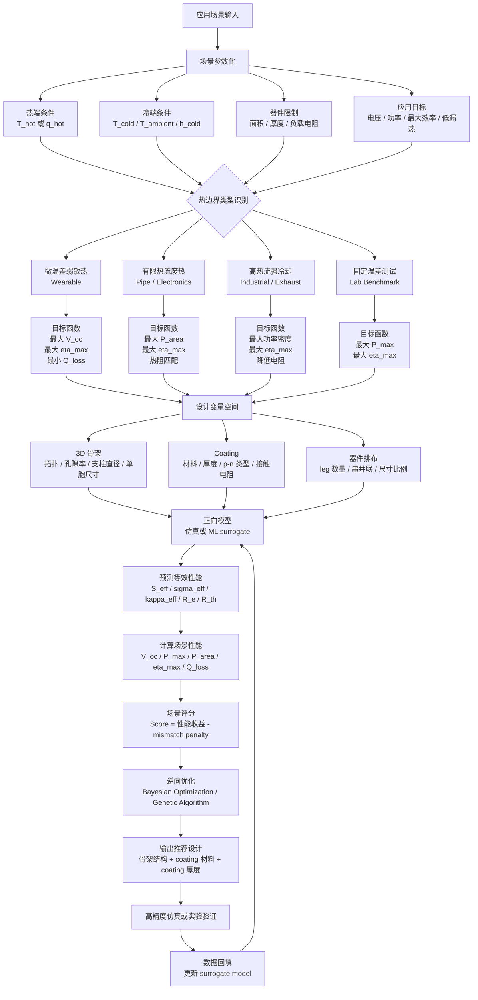

# 3D 骨架热电涂层器件的场景化逆向设计流程

> 校对稿：本文件用于整理“3D 打印骨架 + 外层热电 coating”器件如何与不同应用场景匹配。当前版本暂不考虑机械性能，只关注热边界、电输运、热输运和输出性能。

## 1. 核心思路

本项目的目标不是简单寻找一个“最优 3D 结构”，而是建立一个可以根据具体应用场景反推设计参数的逆向设计流程。

基本逻辑为：

```text
应用场景 -> 热边界条件 -> 目标函数/约束 -> ML 逆向推荐结构和 coating
```

其中，应用场景不能只用名称表示，例如 wearable、industrial 或 exhaust pipe。每个场景都应该被转化为一组可计算的物理参数，包括热源条件、冷端条件、器件尺寸限制、负载条件和性能目标。

## 2. 场景参数化

每个应用场景可以表示为：

```text
Scenario = {
  hot_side: T_hot 或 q_hot,
  cold_side: T_cold 或 T_ambient,
  convection: h_hot, h_cold,
  device_limit: area, thickness, volume,
  electrical_load: R_load,
  target: voltage / power / maximum_efficiency / heat_blocking
}
```

建议优先记录以下参数：

| 参数类别 | 参数            | 物理意义               |
| :--- | :------------ | :----------------- |
| 热端条件 | `T_hot`       | 热端固定温度             |
| 热端条件 | `q_hot`       | 输入热流密度             |
| 冷端条件 | `T_cold`      | 冷端固定温度             |
| 冷端条件 | `T_ambient`   | 环境温度               |
| 换热条件 | `h_hot`       | 热端对流换热系数           |
| 换热条件 | `h_cold`      | 冷端对流换热系数           |
| 器件限制 | `A_device`    | 器件可用面积             |
| 器件限制 | `L_device`    | 器件厚度或热流方向长度        |
| 电学条件 | `R_load`      | 外接负载电阻             |
| 应用目标 | `target_type` | 优先优化电压、功率、最大效率或低漏热 |

## 3. 设计变量空间

在不考虑机械性能的情况下，设计变量主要分为三类。

### 3.1 3D 骨架几何

| 变量 | 符号 | 说明 |
| :--- | :--- | :--- |
| 拓扑类型 | `lattice_type` | FCC、Gyroid、Diamond、I-shape、hourglass、拓扑优化结构等 |
| 单胞尺寸 | `cell_size` | 控制几何尺度和比表面积 |
| 支柱直径 | `strut_diameter` | 控制孔隙率、热阻和 coating 有效面积 |
| 孔隙率 | `porosity` | 控制等效热导率和热阻 |
| 阵列数 | `N_x, N_y, N_z` | 控制器件整体尺寸和路径长度 |
| 截面梯度 | `geometry_gradient` | 控制沿热流方向的变截面，如 I-shape 或 hourglass |

### 3.2 热电 coating

| 变量         | 符号              | 说明                            |
| :--------- | :-------------- | :---------------------------- |
| coating 材料 | `material_id`   | 例如 Bi2Te3、Sb2Te3、PbTe、Cu2Se 等 |
| coating 厚度 | `t_coating`     | 影响电导、热导和电阻                    |
| 塞贝克系数      | `S_coat(T)`     | 可为温度相关函数                      |
| 电导率        | `sigma_coat(T)` | 可为温度相关函数                      |
| 热导率        | `kappa_coat(T)` | 可为温度相关函数                      |
| 接触电阻       | `R_contact`     | coating 与电极之间的电接触损耗           |
| 接触热阻       | `R_th_contact`  | coating、骨架和电极之间的界面热阻          |

### 3.3 器件排布

| 变量 | 符号 | 说明 |
| :--- | :--- | :--- |
| p/n leg 数量 | `N_pair` | 影响输出电压和内阻 |
| 串并联方式 | `connection_type` | 影响输出电压、电流和负载匹配 |
| leg 长度 | `L_leg` | 影响热阻和电阻 |
| leg 横向面积 | `A_leg` | 影响热流、电阻和功率密度 |

## 4. 等效性能预测

对于任意候选设计 `x`，正向模型需要预测以下等效性能：

```text
ForwardModel(x) -> {
  S_eff,
  sigma_eff,
  kappa_eff,
  R_e,
  R_th,
  V_oc,
  P_max,
  P_area,
  eta,
  eta_max,
  Q_loss
}
```

其中：

```text
R_th ≈ L_device / (kappa_eff * A_device)
R_e  ≈ L_electrical_path / (sigma_eff * A_electrical_path)
V_oc ≈ S_eff * DeltaT_device
P_max ≈ V_oc^2 / (4 * R_e)
P_load = V_oc^2 * R_load / (R_e + R_load)^2
eta ≈ P_load / Q_hot
eta_max = max_R_load eta(R_load)
```

其中 `eta_max` 表示在给定热边界和设计结构下，通过负载扫描或负载优化得到的最大转换效率。它和 `P_max` 不同：`P_max` 关注最大输出功率，`eta_max` 关注输入热量被转化为电功的最高比例。

## 5. 场景分类与匹配逻辑

### 5.1 微温差弱散热场景

典型应用：

```text
wearable thermoelectric generator
人体热收集
室内低品位热源
```

物理特征：

```text
DeltaT_source 小
h_cold 低
自然对流为主
热源能力有限
```

主要问题：

```text
如果器件 kappa_eff 过高，热量会快速泄漏，实际 DeltaT_device 会显著降低。
```

优化目标：

```text
maximize V_oc 或 P_area
maximize eta_max when heat budget is important
minimize Q_loss
maintain high R_th
```

推荐的设计倾向：

```text
高孔隙率骨架
细支柱
薄 coating
高 S_coat 材料
低 kappa_eff
高热阻
```

示例评分函数：

```text
score_wearable =
  w1 * normalize(V_oc)
  + w2 * normalize(P_area)
  + w3 * normalize(eta_max)
  - w4 * normalize(Q_loss)
```

### 5.2 有限热流废热场景

典型应用：

```text
中低温管道废热
电子器件余热
小型工业热表面
```

物理特征：

```text
热源有一定热流输入
冷端可能是自然对流或中等强度风冷
热流不是无限供应
```

主要问题：

```text
器件热阻太高，热量进不来；
器件热阻太低，温差保不住。
```

优化目标：

```text
maximize P_area
maximize eta_max
match R_TE with R_external
avoid excessive heat leakage
```

热阻匹配项：

```text
R_TE ≈ L_device / (kappa_eff * A_device)
R_external ≈ 1 / (h_hot * A_device) + 1 / (h_cold * A_device)
thermal_mismatch = abs(log(R_TE / R_external))
```

推荐的设计倾向：

```text
中等孔隙率
中等 coating 厚度
平衡 sigma_eff 和 kappa_eff
几何可出现 I-shape 或 hourglass
优先做热阻匹配
```

示例评分函数：

```text
score_waste_heat =
  w1 * normalize(P_area)
  + w2 * normalize(eta_max)
  - w3 * normalize(thermal_mismatch)
```

### 5.3 高热流强冷却场景

典型应用：

```text
工业尾气
车辆排气管
高温炉壁
强制风冷或水冷 TEG
```

物理特征：

```text
T_hot 或 q_hot 较高
h_cold 较高
热端和冷端都能提供较强换热
DeltaT_device 相对容易建立
```

主要问题：

```text
当温差不再是主要瓶颈时，内阻和电流输出会变得更重要。
```

优化目标：

```text
maximize power density
maximize eta_max
reduce R_e
maintain suitable R_th
match electrical load
```

推荐的设计倾向：

```text
较厚 coating
较高 sigma_coat 材料
较低孔隙率或更连续的电通路
不一定追求极低 kappa_eff
优先降低电阻和提升功率密度
```

示例评分函数：

```text
score_industrial =
  w1 * normalize(P_area)
  + w2 * normalize(P_load)
  + w3 * normalize(eta_max)
  - w4 * normalize(R_e)
  - w5 * normalize(thermal_mismatch)
```

### 5.4 固定温差测试场景

典型应用：

```text
实验室标准测试
文献对标
固定 T_hot 和 T_cold 的模块评估
```

物理特征：

```text
T_hot 和 T_cold 已知
DeltaT_device 近似由边界直接指定
结构对维持温差的贡献减弱
```

主要问题：

```text
在固定温差下，热阻优化收益通常小于固定热流或对流场景。
```

优化目标：

```text
maximize P_max
maximize eta_max
reduce R_e
increase effective power factor
```

推荐的设计倾向：

```text
coating 可以相对更厚
优先高 sigma_coat 和高 S_coat 材料
几何优化重点转向降低电阻和提高有效导电路径
```

示例评分函数：

```text
score_fixed_T =
  w1 * normalize(P_max)
  + w2 * normalize(eta_max)
  - w3 * normalize(R_e)
```

## 6. 场景化逆向设计流程图



## 7. 推荐的初始 benchmark 场景

为了让项目先形成可验证闭环，建议先做三个 benchmark 场景。

### 7.1 Wearable Low-Grade Heat

```text
T_hot: 306-310 K
T_ambient: 293-298 K
h_cold: 5-15 W m^-2 K^-1
target: maximize V_oc, P_area and eta_max, minimize Q_loss
```

关注问题：

```text
在微小源温差下，什么骨架和 coating 厚度最能保住 DeltaT_device？
```

### 7.2 Pipe Waste Heat Recovery

```text
q_hot: 5000-10000 W m^-2
T_ambient: 293 K
h_cold: 50-300 W m^-2 K^-1
target: maximize P_area and eta_max with thermal impedance matching
```

关注问题：

```text
在有限热流输入下，最佳 R_TE / R_external 比值对应什么几何和 coating 厚度？
```

### 7.3 Fixed-Temperature Module Test

```text
T_hot: 400-550 K
T_cold: 293-323 K
target: maximize P_max or eta_max
```

关注问题：

```text
在固定 DeltaT 下，结构优化相对于 coating 材料和厚度优化还能带来多少收益？
```

## 8. ML 任务定义

### 8.1 正向代理模型

训练数据：

```text
X = [
  lattice_type,
  cell_size,
  strut_diameter,
  porosity,
  geometry_gradient,
  coating_material,
  t_coating,
  S_coat,
  sigma_coat,
  kappa_coat,
  contact_resistance,
  T_hot,
  q_hot,
  T_cold,
  T_ambient,
  h_hot,
  h_cold,
  A_device,
  L_device,
  R_load
]

Y = [
  S_eff,
  sigma_eff,
  kappa_eff,
  R_e,
  R_th,
  V_oc,
  P_max,
  P_area,
  eta,
  eta_max,
  Q_loss
]
```

模型选择：

```text
XGBoost / Random Forest: 适合早期小数据集和可解释性分析
MLP: 适合较大仿真数据集
Gaussian Process: 适合贝叶斯优化和不确定性估计
Graph Neural Network: 适合后期直接输入复杂 3D 拓扑
```

### 8.2 逆向优化

逆向设计输入：

```text
scenario parameters
design constraints
target preference
```

逆向设计输出：

```text
recommended lattice_type
recommended geometry parameters
recommended coating material
recommended coating thickness
predicted performance
scenario score
```

优化算法：

```text
Bayesian Optimization: 适合连续变量，例如 coating 厚度、孔隙率、支柱直径
Genetic Algorithm: 适合混合变量，例如材料、拓扑类型、串并联方式
Multi-objective Optimization: 适合同时优化 P_area、eta_max、Q_loss
```

## 9. 当前阶段的项目表述

可以将当前研究方向表述为：

```text
本项目面向 3D 打印骨架-热电薄膜 coating 核壳器件，建立一个场景化机器学习逆向设计框架。该框架将应用场景转化为热边界条件和输出需求，通过仿真或实验数据训练正向代理模型，预测不同骨架结构、coating 材料和 coating 厚度下的等效热电性能，并进一步结合热阻匹配和负载匹配原则，反推出适用于特定场景的最优器件结构。
```

更简洁的版本：

```text
我们不是寻找单一最优热电结构，而是建立一个根据热边界和输出需求自适应推荐 3D 骨架与热电 coating 的逆向设计平台。
```
